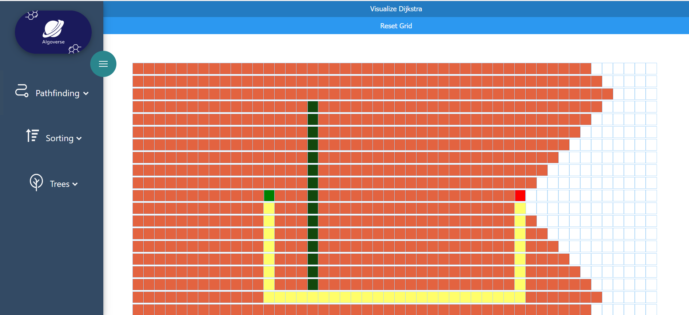

# Algoverse

is a learning platform for visualizing algorithms. This project was developed at the Sungkyunkwan University in the fall semester of year 2023 as part of the Capstone Design Project course SWE3028-41.

## Pathfinding

Visualize will start the algorithm and show you the correct path. The resetButton changes the css of the nodes so you can start from anew.

Clicking on nodes enables the creation of walls. 

Below additional useful information can be seen. Like real life uses for these algorithms and their computational complexity in Big O Notation. Pythonesque code is also included to make implementing them in your own code very easy.

## Sorting

## Tree Search