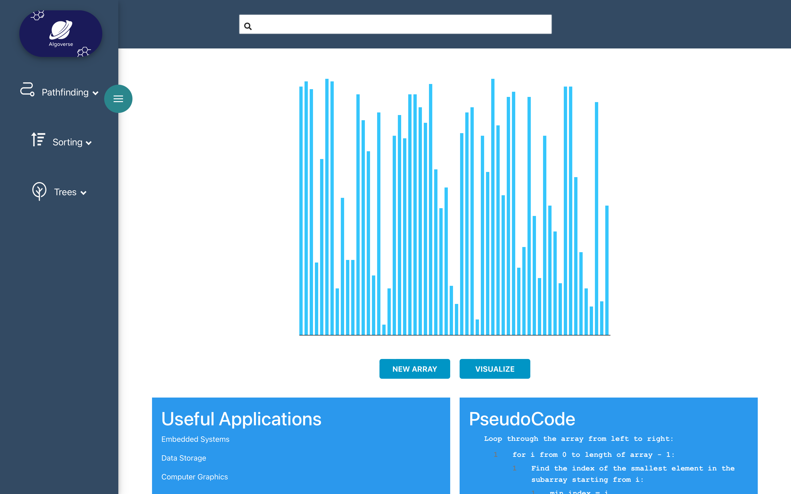

# Algoverse

is a learning platform for visualizing algorithms. This project was developed at the Sungkyunkwan University in the fall semester of year 2023 as part of the Capstone Design Project course SWE3028-41.

## Pathfinding

Visualize will start the algorithm and show you the correct path. The resetButton changes the css of the nodes so you can start from anew.

Clicking on nodes enables the creation of walls.

Below additional useful information can be seen. Like real life uses for these algorithms and their computational complexity in Big O Notation. Pythonesque code is also included to make implementing them in your own code very easy.

## Sorting
Visualize 'Algorithm name'  will start the algorithm and show you the animations of every step to get the array sorted. The 'Reset Array' button randomly generates an array so that the user can visualize the algorithm with different data.

Down below useful information can be seen, as said previously in Pathfinding.

## Tree Search

Users can create trees as they wish and can observe search algorithm animation on the created trees.

Users can add, or delete nodes to a binary tree. 

Three search buttons show corresponding search algorithm visualization. Below is the result of binary search(14).

Pink color means this node is visited, blue color means this is the node user wanted to search.
If there is no blue node, it means failed to search target node.

Reset button reset the canvas.

Below additional useful information can be seen like other algorithms.

